<h1 align="center">Halpwords</h1>

<p align="center">
  <strong>An 8-bit dungeon crawler where spelling is your sword.</strong><br>
  Learn French, Latin, Ancient Greek or Irish by typing your way through a
  first-person dungeon, in the style of the classic Commodore 64 crawlers.
</p>

<p align="center">
  <a href="https://github.com/halpworld/halpwords/actions/workflows/ci.yml"></a>
  <a href="LICENSE"></a>
  <a href="go.mod"></a>
  
  <a href="https://ebitengine.org"></a>
</p>

<p align="center">
  <a href="https://halpworld.github.io/halpwords/"><b>Play in your browser</b></a> ·
  <a href="#download">Download</a> ·
  <a href="#quick-start">Build from source</a> ·
  <a href="#how-to-play">How to play</a> ·
  <a href="#controls">Controls</a> ·
  <a href="#your-own-word-lists">Word lists</a> ·
  <a href="#ai-helper-optional">AI helper</a> ·
  <a href="#roadmap">Roadmap</a> ·
  <a href="#contributing">Contributing</a>
</p>

<p align="center">
  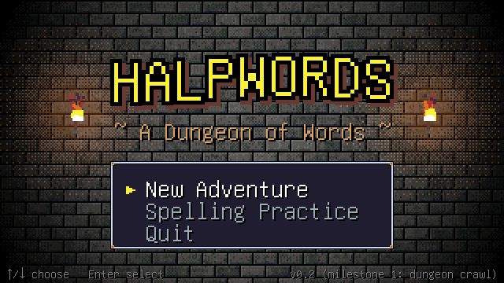
</p>

## About

Halpwords is a spelling game disguised as a dungeon crawl. You explore a
randomly generated dungeon one grid step at a time. Everything that matters
comes down to typing a word: you attack monsters by translating quickly and
correctly, you dodge by typing before the timer runs out, and you break sealed
doors and open treasure chests by spelling.

It is written for secondary-school students (around 13) and keeps a friendly,
adventurous tone. It runs offline, needs no accounts, and ships as a single
file.

> [!NOTE]
> **Version 1.0: every milestone in the [plan](PLAN.md) is done.** Play it
> [in your browser](https://halpworld.github.io/halpwords/), or
> [download it](#download) for macOS, Windows or Linux. Found a bug? Please
> [open an issue](https://github.com/halpworld/halpwords/issues).

## Features

- **First-person dungeon crawling.** A raycast 3D view, step-by-step grid
  movement, an automap and a full map, a compass, and floors that get bigger
  as you go down.
- **Typing battles.** Translate to attack: the faster and more accurate you
  are, the more damage you do, and a streak of good answers builds a combo.
  Translate before the monster's timer runs out to dodge.
- **Monster traits.** Deeper down, monsters have tricks: **Armored** ones
  only take damage from exact spelling, **Ghostly** ones make their words
  fade away, **Mirrored** ones write them backwards, and **Swift** ones leave
  less time to dodge.
- **Word puzzles.** Rune-sealed doors and locked chests hold nine kinds of
  puzzle: read a rune and give its meaning, pick the odd one out, match words
  to their meanings, solve a riddle, unscramble letter tiles, fill in missing
  letters, turn the letter wheels of a tumbler lock, fill in a mini
  crossword, or spell a word from memory. A wrong answer springs a trap, and
  from floor 2 some chests are **Mimics** that bite back.
- **Heroes and gear.** Play a sturdy **Knight**, a word-wise **Scribe** or
  a lucky **Rogue**. Level up, find and buy weapons, armour and trinkets
  with generated names ("Iron Ring of Swiftness"), and carry potions,
  ethers, Hint Scrolls, Hourglasses and Runes of Clarity.
- **Shrines, campfires, merchants and bosses.** Pray at **Save Shrines** to
  save your adventure, rest at **campfires** to heal and see your weakest
  words, trade with the **merchant**, and beat the crowned **boss** that
  guards the stairs every third floor.
- **Spaced repetition.** Every word has a Leitner box (1 to 5). Perfect
  answers move it up, misses send it back to box 1, and monsters mostly ask
  for the words that are due, plus a few new ones. What you have learned
  carries over from one adventure to the next, and to Practice.
- **The Grimoire.** See how well you know every word: its box, how often
  you get it right, how fast you type it, and your most common kind of
  slip (accents, double letters, swapped letters...).
- **Hardcore mode.** One life, no shrines and a score. Play the **Daily
  Dungeon** (the same dungeon for everyone with the same word lists), or
  challenge a friend to your dungeon with its **seed code**. Every run ends
  with a **share code** friends can check, and the best go in the **Hall
  of Fame**.
- **Settings for each language.** Make accents, fadas, macrons, breathings,
  articles and capitals strict, reduced credit or ignored, turn on live typo
  highlighting, and choose relaxed, normal or fast timers.
- **Hints.** Stuck on a word? <kbd>F4</kbd> shows the next letter for a
  little MP.
- **Pause and suspend.** <kbd>Esc</kbd> pauses the game, battle clock
  included. Suspend and quit from the pause menu, and pick up where you
  left off with **Continue**.
- **Four languages.** French, Latin, Ancient Greek (polytonic) and Irish, with
  a built-in starter list of about 100 words each: animals, family, home,
  school, food, the body, numbers, colours, verbs, gods and the dungeon.
- **Forgiving grading.** Answers are graded as Perfect, Correct, Accent slip,
  Graze or Miss, so a missing accent or a small typo still counts for
  something.
- **Easy accents.** Press <kbd>Tab</kbd> to cycle the accent on the last letter
  (e → é → è → ê → ë). Ancient Greek has a built-in Greek keyboard with
  breathings and accents.
- **Bring your own words.** Word lists are plain text files you can write in
  any editor. Import them by dropping them on the game, add to or delete
  lists, and save them from the **Word Lists** screen.
- **Practice mode.** Drill words without the dungeon, dealt by spaced
  repetition.
- **Optional AI helper.** A parent or teacher picks **Anthropic (Claude),
  OpenAI, Meta or DeepSeek** and pastes an API key. The dungeon then names
  its floors after your words, deals gap-fill sentences and fresh riddles,
  has monsters taunt you in the language you learn, writes memory tips for
  words you keep missing, and forges new word lists on any topic. It shows
  what has been spent and stops at a budget you set. Without it the game
  plays exactly the same.
- **Music for every moment.** A chiptune composer writes the music as you
  play: a calm theme for each floor, drums for battles, something darker
  for bosses, and a quiet tune by the campfire.
- **Juicy.** Sparks fly off every blow, critical hits stop time for a
  moment, chests shower coins, and seals break in a burst of runes.
- **Sound and screen settings.** Music and effect volumes, full screen,
  screen shake, and an optional **CRT filter** with scanlines and curved
  glass, for the full 1980s look.
- **Nearly all generated in code.** Textures, monsters, effects, sound
  effects, music and even the app icon are procedural. The only art asset
  is a pixel font.
- **Runs everywhere.** macOS (Apple Silicon and Intel), Windows, Linux and the
  web (WebAssembly).

## Screenshots

<table>
  <tr>
    <td width="50%">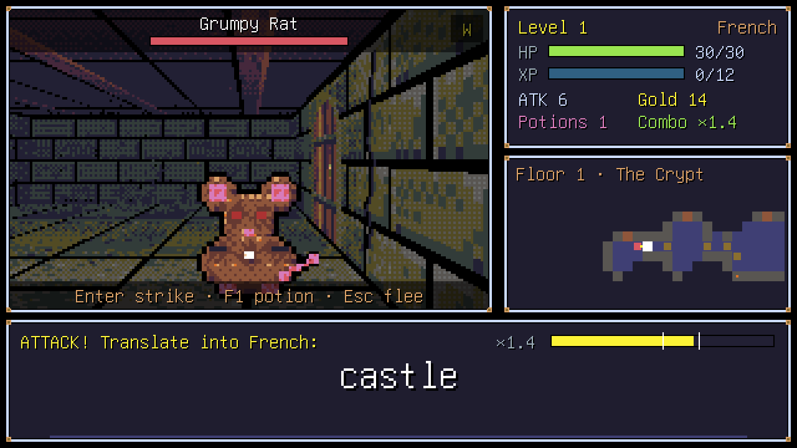</td>
    <td width="50%">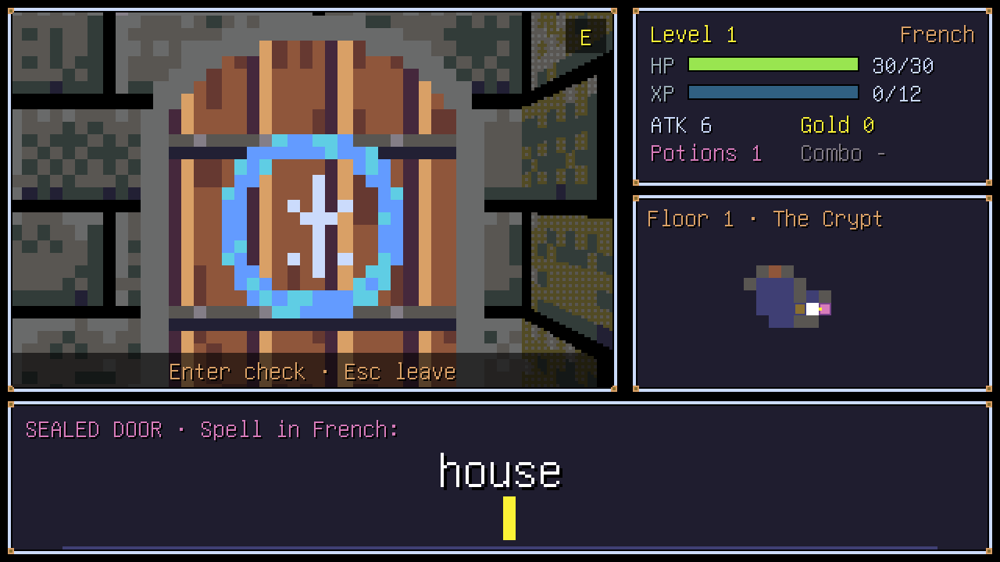</td>
  </tr>
  <tr>
    <td align="center"><b>Typing battles:</b> translate to attack, and type fast to dodge.</td>
    <td align="center"><b>Sealed doors:</b> spell the word to break the runes.</td>
  </tr>
  <tr>
    <td width="50%">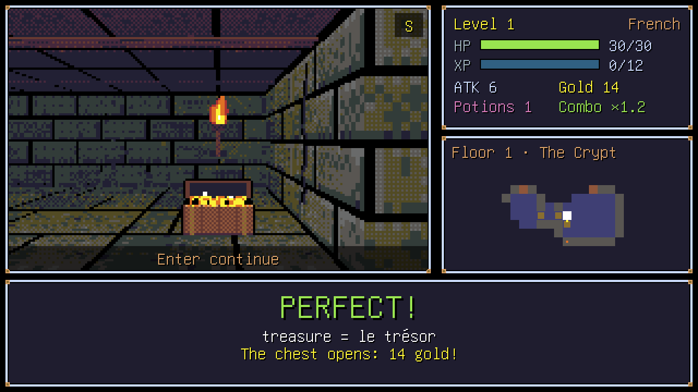</td>
    <td width="50%">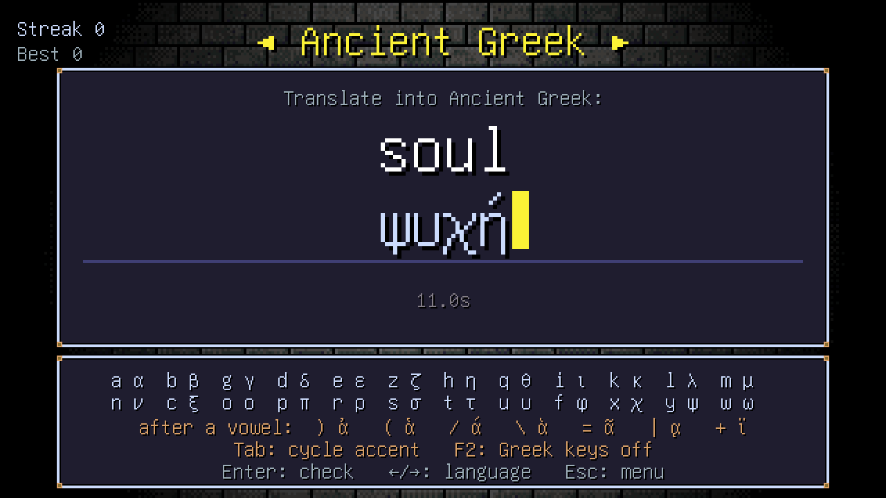</td>
  </tr>
  <tr>
    <td align="center"><b>Treasure chests:</b> fill in the missing letters.</td>
    <td align="center"><b>Ancient Greek:</b> type polytonic Greek on any keyboard.</td>
  </tr>
  <tr>
    <td width="50%">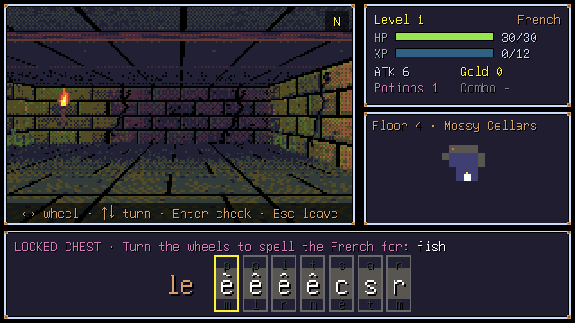</td>
    <td width="50%">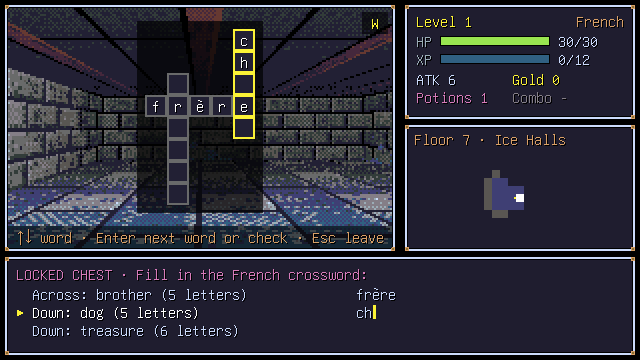</td>
  </tr>
  <tr>
    <td align="center"><b>Tumbler locks:</b> turn the wheels to spell the word.</td>
    <td align="center"><b>Mini crosswords:</b> words that share a letter.</td>
  </tr>
  <tr>
    <td width="50%">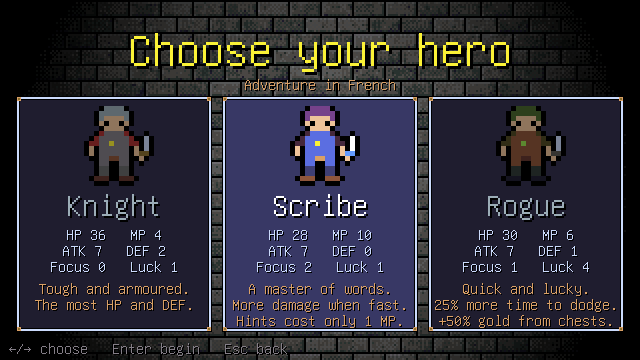</td>
    <td width="50%">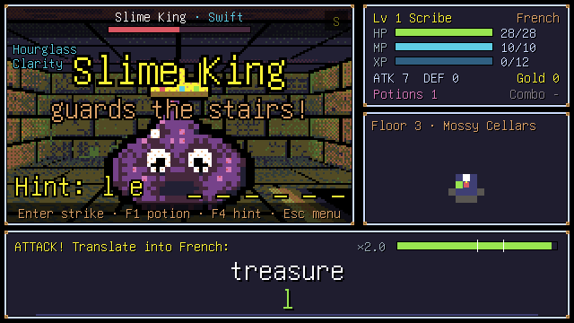</td>
  </tr>
  <tr>
    <td align="center"><b>Three heroes:</b> Knight, Scribe or Rogue.</td>
    <td align="center"><b>Bosses</b> guard the stairs. <kbd>F4</kbd> buys a hint.</td>
  </tr>
  <tr>
    <td width="50%">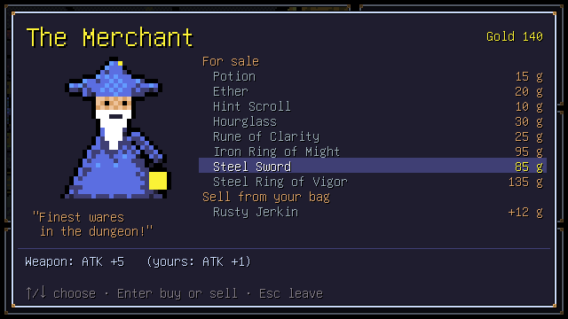</td>
    <td width="50%">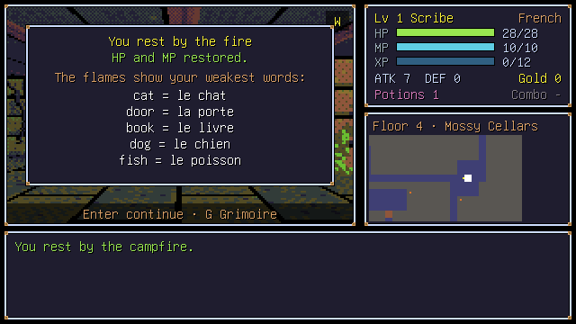</td>
  </tr>
  <tr>
    <td align="center"><b>The merchant</b> buys and sells.</td>
    <td align="center"><b>Campfires</b> heal and show your weakest words.</td>
  </tr>
  <tr>
    <td width="50%">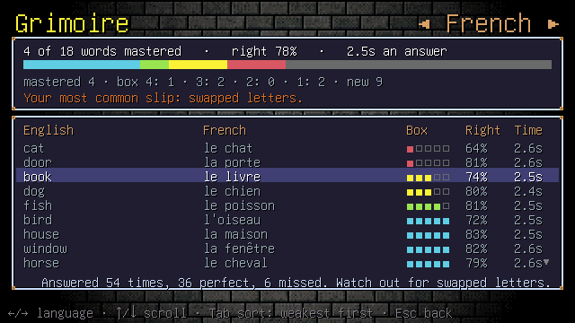</td>
    <td width="50%">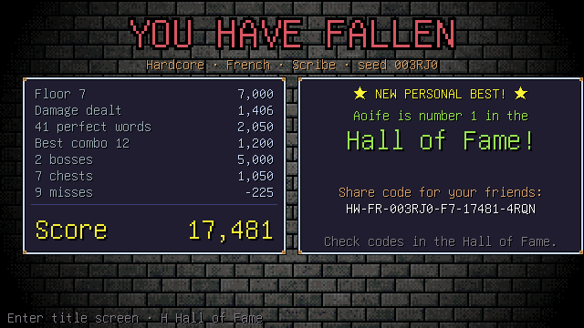</td>
  </tr>
  <tr>
    <td align="center"><b>The Grimoire</b> shows how well you know each word.</td>
    <td align="center"><b>Hardcore</b> runs end with a score and a share code.</td>
  </tr>
  <tr>
    <td width="50%">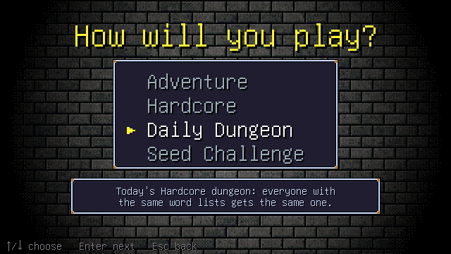</td>
    <td width="50%">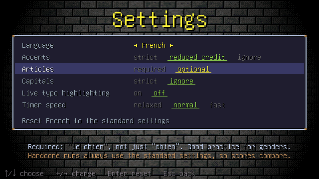</td>
  </tr>
  <tr>
    <td align="center"><b>Four ways to play</b>, including a Daily Dungeon.</td>
    <td align="center"><b>Settings</b> for sound, screen and each language.</td>
  </tr>
  <tr>
    <td width="50%">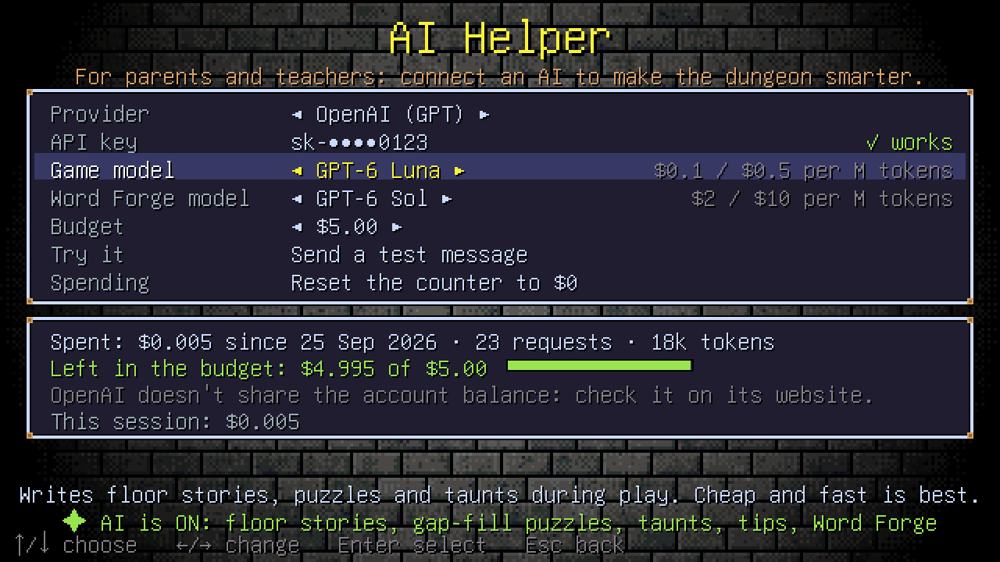</td>
    <td width="50%">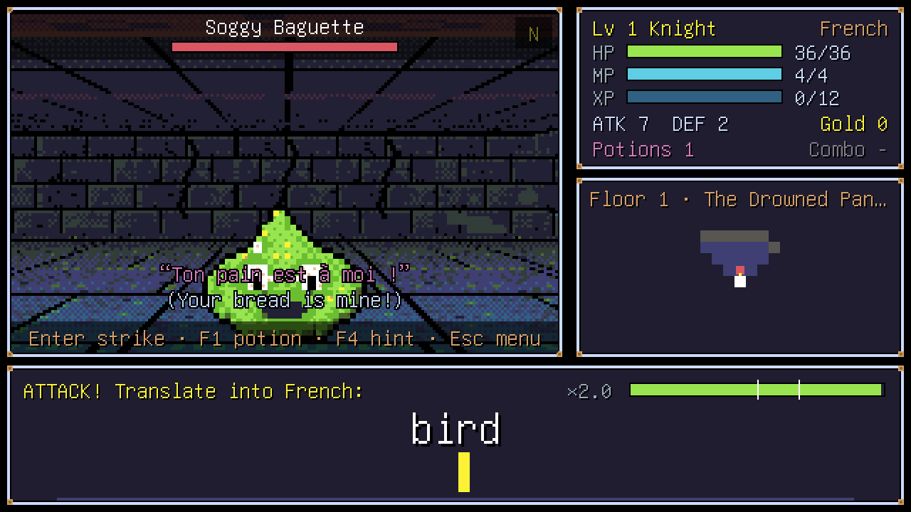</td>
  </tr>
  <tr>
    <td align="center"><b>The AI Helper:</b> choose a provider, paste a key, set a budget.</td>
    <td align="center"><b>With AI:</b> themed floors and monsters that taunt in French.</td>
  </tr>
  <tr>
    <td width="50%">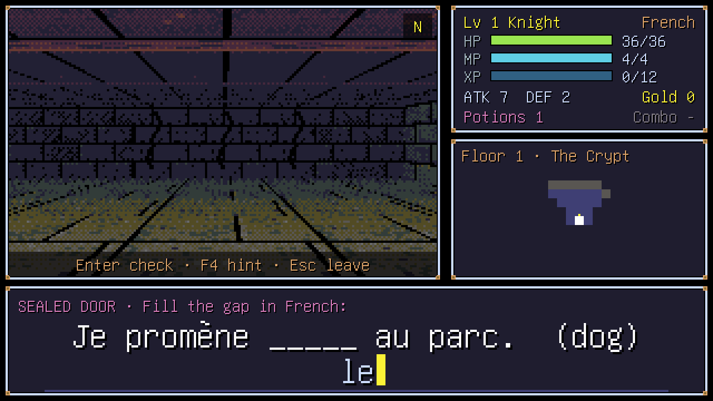</td>
    <td width="50%">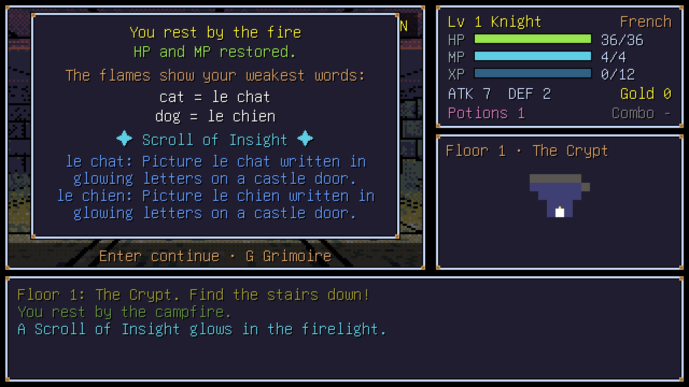</td>
  </tr>
  <tr>
    <td align="center"><b>Gap-fill puzzles</b> put your words in sentences.</td>
    <td align="center"><b>A Scroll of Insight</b> with tips for tricky words.</td>
  </tr>
  <tr>
    <td colspan="2">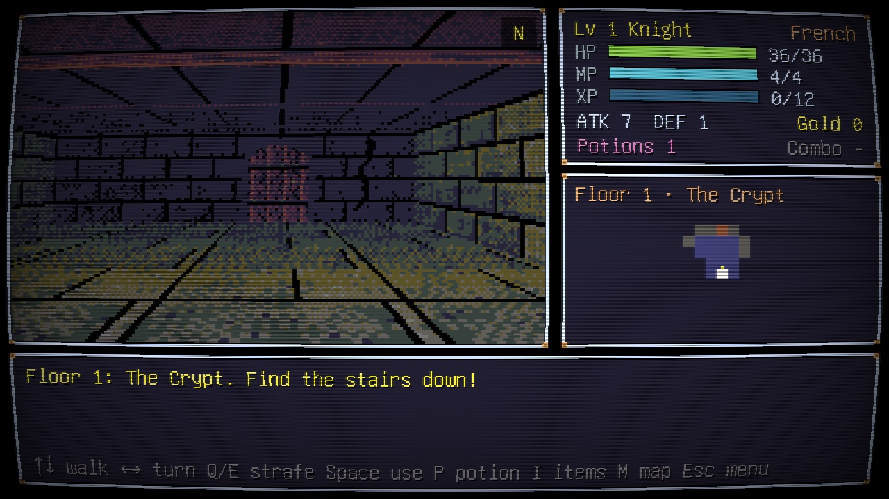</td>
  </tr>
  <tr>
    <td colspan="2" align="center"><b>The CRT filter</b>, for the full 1980s look.</td>
  </tr>
</table>

## Download

| Where | Get it |
|---|---|
| **Any web browser** | Play at **<https://halpworld.github.io/halpwords/>**. Nothing to install; your progress stays in that browser. |
| **macOS** (Apple Silicon and Intel) | `Halpwords-<version>-macos.zip` from the [latest release](https://github.com/halpworld/halpwords/releases/latest). Unzip it and drag **Halpwords** to Applications. |
| **Windows** 10 and 11 | `Halpwords-<version>-windows-amd64.zip` (or `-arm64` for Windows on Arm) from the [latest release](https://github.com/halpworld/halpwords/releases/latest). Unzip it and run `halpwords.exe`. |
| **Linux** (x86-64) | `Halpwords-<version>-linux-amd64.tar.gz` from the [latest release](https://github.com/halpworld/halpwords/releases/latest). Unpack it and run `./halpwords`. |

Each release lists SHA-256 checksums in `SHA256SUMS.txt`.

<details>
<summary><b>macOS says the app can't be opened</b></summary>

Builds that are not signed with an Apple Developer ID are stopped by
Gatekeeper the first time. Right-click (or Control-click) **Halpwords** in
Finder, choose **Open**, then **Open** again. You only need to do this once.

</details>

<details>
<summary><b>Windows says it protected your PC</b></summary>

SmartScreen warns about new programs it hasn't seen often. Choose **More
info**, then **Run anyway**.

</details>

<details>
<summary><b>For schools</b></summary>

- The game needs no account, no installer and no internet. Copy the unzipped
  folder (or `Halpwords.app`) to each computer, or use the web version.
- Each player's progress, settings and word lists are kept in their user
  folder (see [where your files are](#where-your-files-are)), so shared
  computers keep each student's progress apart when students log in as
  themselves.
- The AI helper is off until a parent or teacher sets it up. See
  [AI helper](#ai-helper-optional).

</details>

## Quick start

To build the game yourself you need [Go 1.26 or newer](https://go.dev/dl/).
It takes one command.

```sh
git clone https://github.com/halpworld/halpwords.git
cd halpwords
make run            # or: go run ./cmd/halpwords
```

Then choose **New Adventure**, pick how to play, a language and a hero, and
find the stairs down.

<details>
<summary><b>macOS</b></summary>

1. Install Go: `brew install go` (or use the installer from
   <https://go.dev/dl/>).
2. Run `make run`.
3. To make a double-clickable app, run `make bundle-mac` and open
   `dist/Halpwords.app`.

</details>

<details>
<summary><b>Windows</b></summary>

1. Install Go from <https://go.dev/dl/>.
2. In the `halpwords` folder, run `go run ./cmd/halpwords`.
3. To make an `.exe`, run `make build-windows` (it works from any OS). The
   file is `dist/windows-amd64/halpwords.exe`.

</details>

<details>
<summary><b>Linux</b></summary>

Ebitengine needs the X11, OpenGL and ALSA development packages. On Debian or
Ubuntu:

```sh
sudo apt-get install libgl1-mesa-dev libxrandr-dev libxcursor-dev \
  libxinerama-dev libxi-dev libxxf86vm-dev libasound2-dev
make run
```

</details>

<details>
<summary><b>Web browser</b></summary>

```sh
make build-web
python3 -m http.server -d dist/web
```

Then open <http://localhost:8000>.

</details>

> [!TIP]
> Every push is built for all platforms by
> [GitHub Actions](https://github.com/halpworld/halpwords/actions/workflows/ci.yml).
> You can download these builds from a run's **Artifacts** section.

## How to play

<p align="center">
  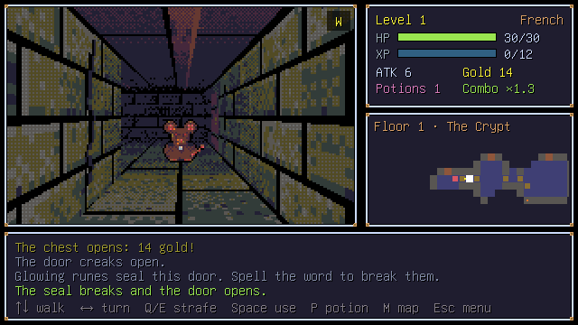
</p>

1. **Explore.** Walk through the dungeon one step at a time. The minimap fills
   in as you go. Press <kbd>M</kbd> for the full map.
2. **Fight.** Monsters wander, and they chase you once they spot you. When one
   reaches you, a battle starts.
   - **Attack:** translate the English word into your language and press
     <kbd>Enter</kbd>. Speed, accuracy and your combo all add to the damage.
   - **Dodge:** when the monster strikes, translate the word before the timer
     runs out.
   - Press <kbd>F1</kbd> to drink a potion, or <kbd>F4</kbd> for a hint:
     it shows the next letter for 2 MP (1 for a Scribe), or uses up a Hint
     Scroll. A word you needed a hint for comes back for practice later.
   - <kbd>Esc</kbd> pauses the battle and stops its clock. From the pause
     menu you can use **Items** or **Flee**. Using an item takes your turn.
   - A perfect answer restores 1 MP, and the first time you spell a word
     perfectly you earn 2 XP.
   - From floor 2, some monsters have **traits**, shown next to their name.
     The first time you meet one, the game explains it. From floor 4, any
     monster can have an extra trait, such as a *Swift Grumpy Rat*.
3. **Unlock.** Walk into a sealed door or a treasure chest to get a word
   puzzle. Doors ask for meanings, odd words out, matching pairs, riddles
   and anagrams; chests ask for careful spelling (missing letters, tumbler
   locks and, from floor 3, crosswords) and hold gold, items and sometimes
   gear. Solving a puzzle earns XP; <kbd>F4</kbd> gives hints on puzzles you
   type. A wrong answer sets off a trap, or wakes a Mimic: it keeps the loot
   until you defeat it.
4. **Grow stronger.** Each class grows differently as it levels up. Press
   <kbd>I</kbd> for your items and gear: wear better gear, drop what you
   don't need, and drink potions or ethers. An **Hourglass** gives you half
   as much time again to type in your next battle, and a **Rune of
   Clarity** turns your typing red as soon as it goes wrong.
5. **Use what you find.**
   - **Save Shrines** (a floating blue crystal) stand in the first room of
     floors 2, 3, 5, 6, 8, 9 and so on. Pray at one to save your adventure.
   - **Campfires** heal you and restore your MP once, and show your weakest
     words. Press <kbd>G</kbd> there to open the Grimoire.
   - The **merchant** sells items and three pieces of gear, and buys gear
     from your bag for half its price.
6. **Beat the bosses.** Every third floor, a crowned boss guards the stairs,
   and the stairs won't open until it is defeated. Bosses grow swift and
   then write their words backwards as they weaken, ask for longer words,
   and always drop gear.
7. **Falling.** If you are defeated, you wake up at the last shrine you
   prayed at (or the dungeon's entrance) as you were when you prayed, with a
   fifth of your gold gone. The floor there is new. The words you have
   practised are never lost.
8. **Take a break.** Press <kbd>Esc</kbd> to pause. **Suspend and quit**
   keeps the game exactly as it is, and **Continue** on the title screen
   picks it up. A suspended game can only be continued once; after that,
   Continue takes you back to your last shrine. You can't suspend in the
   middle of a battle. There is one save slot. On the desktop it is
   `adventure.json`, next to the [`words` folder](#your-own-word-lists); on
   the web it is kept in the browser's local storage.

### Learning your words

Every word you answer, in the dungeon or in **Practice**, goes into your
**Grimoire**. Each word sits in one of five boxes: a perfect answer moves it
up a box, a correct answer fixed with backspace keeps it where it is, an
accent slip, a graze or a hint moves it down one, and a miss sends it back
to box 1. Words come back after a few other words in box 1 and after about
120 in box 5, so monsters mostly ask for the words that are due, plus a few
new ones. Deeper floors and bosses ask for longer, harder words.

Open the Grimoire from the title screen, from the pause menu, or at a
campfire. <kbd>Tab</kbd> sorts it by weakest first, list order or A to Z.
When you get a word wrong, the game says what kind of slip it was: a missing
accent, a double letter, two letters swapped, a letter missing, extra or
wrong.

### Adventure, Hardcore and the Daily Dungeon

**New Adventure** asks how you want to play:

- **Adventure:** Save Shrines, and falling wakes you at the last one. Your
  own [settings](#settings) apply.
- **Hardcore:** one life, no Save Shrines, and no Hourglasses or Runes of
  Clarity. Every language uses its standard settings with normal timers,
  so scores are fair. You can still suspend a run, but it can only be picked
  up once. The score is:

  | | Points |
  |---|---|
  | Each floor reached | 1,000 |
  | Damage dealt | 1 per HP |
  | Each perfect word (without a hint) | 50 |
  | Best combo | 100 per answer in the streak |
  | Each boss | 2,500 |
  | Each chest opened | 150 |
  | Each miss | −25 |

- **Daily Dungeon:** a Hardcore run in today's dungeon. The dungeon comes
  from the date and your word lists, so everyone with the same lists plays
  the same one.
- **Seed Challenge:** a Hardcore run in a friend's dungeon. Type the
  6-character seed code shown in their pause menu or at the end of their
  run (such as `7K3QZP`), or paste their whole share code.

- **Quest:** hand-made floors played one after another, with a story
  before and after. See [Quests and hand-made maps](#quests-and-hand-made-maps).

At the end of a Hardcore run you get a **share code** such as
`HW-FR-0924-F12-18450-K7QX`: the language, the date (or seed), the floor,
the score and a checksum. Send it to your friends: they can check it under
**Hall of Fame** with <kbd>C</kbd>, which catches typos and edited scores.
Good runs go in the **Hall of Fame**, which keeps the top 10 for each
language, for Hardcore and for the Daily Dungeon. While you play, the map
window shows your score and **★ BEST** once you pass your personal best.

### Settings

**Settings** on the title screen has a **Sound & Screen** tab, and a tab for
each language. The Sound & Screen tab is also in the pause menu, so you can
turn the music down without leaving the dungeon.

| Setting | Choices | Standard |
|---|---|---|
| Music | off to 100% | 60% |
| Sound effects | off to 100% | 80% |
| CRT filter | off · soft · strong | *off* |
| Full screen | on · off | *off* (remembered when you press <kbd>F11</kbd>) |
| Screen shake | on · off | *on* |

The language tabs change how answers are graded:

| Setting | Choices | Standard |
|---|---|---|
| Accents / fadas / macrons | strict · reduced credit · ignore | French and Irish *reduced credit*; Latin and Greek *ignore* |
| Breathings (Ancient Greek) | strict · reduced credit · ignore | *ignore* |
| Articles (French) | required · optional | *optional* |
| Capitals | strict · ignore | *ignore* |
| Live typo highlighting | on · off | *off* |
| Timer speed | relaxed · normal · fast | *normal* |

*Strict* makes a wrong or missing mark a miss; *reduced credit* still
counts it, for less. Live typo highlighting works like a Rune of Clarity
that never runs out. Settings are saved in `settings.json`, what you know of
each word in `progress.json`, and the Hall of Fame in `halloffame.json`,
next to your save.

### AI helper (optional)

The game never needs an AI, but a parent or teacher can connect one to make
the dungeon react to what is being learned. Choose **AI Helper** on the
title screen:

<p align="center">
  
</p>

1. **Choose a provider** with <kbd>←</kbd> / <kbd>→</kbd>.
2. **Paste an API key:** select *API key*, press <kbd>Enter</kbd>, then
   <kbd>Ctrl</kbd>+<kbd>V</kbd> (<kbd>Cmd</kbd>+<kbd>V</kbd> on a Mac). You can
   also type it, or drop a text file holding the key on the window. The game
   checks the key straight away (this costs nothing) and shows **✓ works**.

That's all: the status line turns green and the AI features are on. *Try it*
sends one tiny test message.

| Provider | Get a key at | Game model (default) | Word Forge model (default) | Key from the environment |
|---|---|---|---|---|
| Anthropic (Claude) | [platform.claude.com/settings/keys](https://platform.claude.com/settings/keys) | Claude Haiku 4.5 | Claude Sonnet 5 | `ANTHROPIC_API_KEY` |
| OpenAI (GPT) | [platform.openai.com/api-keys](https://platform.openai.com/api-keys) | GPT-6 Luna | GPT-6 Sol | `OPENAI_API_KEY` |
| Meta (Muse Spark) | [dev.meta.ai](https://dev.meta.ai) → Model API → API keys | Muse Spark 1.3 | Muse Spark 1.3 | `MODEL_API_KEY` or `META_API_KEY` |
| DeepSeek | [platform.deepseek.com/api_keys](https://platform.deepseek.com/api_keys) | DeepSeek V4.1 Flash | DeepSeek V4 Pro | `DEEPSEEK_API_KEY` |

(Meta shut down its old Llama API in 2026; its Model API serves the Muse
Spark models.)

**Models.** The *game model* writes content during play, so a fast, cheap
one is best. The *Word Forge model* makes whole word lists, where a smarter
one makes fewer mistakes. Change either with <kbd>←</kbd> / <kbd>→</kbd>, or
press <kbd>Enter</kbd> for a list with prices. Once the key works, the list
shows every text model it can use.

**Spending.** The screen shows what the game has spent with the provider
(worked out from the tokens each request used and the model's price), the
number of requests, and what is left of the **budget**. Set the budget
($0.50 to $100, or no limit) to what you put on the account: the game stops
using AI when it is spent, and never sends a request that could cost more
than is left. DeepSeek also reports the **account balance** itself, which is
shown too; the other providers don't share it with apps, so check their
websites. After adding credit, *Reset the counter* starts counting from $0.
In-game content is cheap: with the default models a floor costs about a
cent, often much less.

**What it does:**

- **Dungeon Director:** each floor gets a name, a look, a welcome line,
  notes scratched on the walls and new names for its monsters, built around
  the words you will practise ("The Drowned Pantry" for a food list). The
  next floor's script is fetched while you play, so it is ready when you
  arrive.
- **New puzzles:** *gap-fill* sentences in the language you learn, with
  your word missing, and more riddles for the riddle puzzles.
- **Monster taunts** in the language you learn, with the English below.
- **Scroll of Insight:** a word you miss twice gets a memory tip, shown at
  the next campfire.
- **Word Forge:** press <kbd>F</kbd> on the **Word Lists** screen, type a
  topic, choose the language and 10, 20 or 30 words. A second request checks
  every translation and fixes or drops wrong ones. The list then goes
  through the usual import, so look it over before saving it.

**Safe and fair:**

- Every request asks for content suitable for 13-year-olds, and everything
  that comes back is checked before it is used: a word filter, length
  limits, no links, the right alphabet, and puzzles the game's own grader
  can mark. The AI never grades answers.
- Generated content is kept in the user folder (`ai/`), so it is only paid
  for once and is reused in later games.
- Hardcore, the Daily Dungeon and Seed Challenges keep to the built-in
  puzzles, so scores still compare. The AI only renames things there.
- If the AI is slow, offline or out of credit, the game carries on with its
  own content. It stops asking after a few failures in a row.
- It works in the web version too: all four providers accept requests
  straight from the browser.
- The key is saved only on this computer, in `ai.json` in the user folder,
  readable only by you (in a web browser, in the page's local storage). It
  is never put in saves. The AI is only sent words from your lists,
  floor details and Word Forge topics, nothing about the player. What was spent is in
  `ai-spend.json`.

### Linking to a grown-up's account (optional)

A parent or teacher with an account on the Halpwords website can link the
game to it, to see the player's progress and give them word lists. Choose
**Account** on the title screen, then *Link to a grown-up's account*, and
type the code the website shows. The Account screen says who can see the
progress and when the game last synced; *Sync now* sends everything at once,
and *Unlink* stops it (your progress stays, and assigned lists become your
own).

Linked games sync every few minutes and when you quit. Assigned lists appear
in **Word Lists** marked ◆, read-only. Settings a grown-up set are locked in
**Settings**. Nothing changes when the website can't be reached: answers
wait (in `link-queue.json`) until it can. The tokens are kept in
`link.json`, readable only by you. `HALPWORDS_SERVER` points the game at
another server, such as a test one.

## Controls

**In the dungeon**

| Key | Action |
|---|---|
| <kbd>↑</kbd> / <kbd>W</kbd> | Step forward (walk into doors, chests and monsters to use them) |
| <kbd>↓</kbd> / <kbd>S</kbd> | Step back |
| <kbd>←</kbd> / <kbd>A</kbd>, <kbd>→</kbd> / <kbd>D</kbd> | Turn left or right |
| <kbd>Q</kbd> / <kbd>E</kbd> | Strafe left or right |
| <kbd>Space</kbd> / <kbd>Enter</kbd> | Use what's in front (or wait a turn); go down the stairs |
| <kbd>P</kbd> | Drink a potion |
| <kbd>I</kbd> | Items and gear (<kbd>Enter</kbd> use or wear, <kbd>D</kbd> drop) |
| <kbd>M</kbd> | Full map |
| <kbd>G</kbd> | Open the Grimoire (at a campfire) |
| <kbd>Esc</kbd> | Pause menu: items, the Grimoire, sound and screen, suspend, or quit to the title (give up, in Hardcore) |

**In battles and puzzles**

| Key | Action |
|---|---|
| Type + <kbd>Enter</kbd> | Attack, dodge, or solve |
| <kbd>1</kbd>–<kbd>4</kbd>, or <kbd>←</kbd> / <kbd>→</kbd> + <kbd>Enter</kbd> | Pick a word (odd-one-out puzzles) |
| <kbd>↑</kbd> / <kbd>↓</kbd> to choose a word, <kbd>←</kbd> / <kbd>→</kbd> to swap its meaning | Pair matching |
| <kbd>←</kbd> / <kbd>→</kbd> to choose a wheel, <kbd>↑</kbd> / <kbd>↓</kbd> to turn it | Tumbler locks |
| <kbd>↑</kbd> / <kbd>↓</kbd> to choose a word, <kbd>Enter</kbd> for the next one | Crosswords (<kbd>Enter</kbd> checks when every word is filled in) |
| <kbd>F1</kbd> | Drink a potion (in battle, instead of attacking) |
| <kbd>F4</kbd> | Hint: show the next letter, for MP or a Hint Scroll |
| <kbd>Esc</kbd> | Pause (items and flee are in the pause menu), or leave a puzzle |

**Everywhere**

| Key | Action |
|---|---|
| Arrow keys, <kbd>Enter</kbd> | Menus |
| <kbd>Tab</kbd> | Cycle the accent on the last letter (e → é → è → ê → ë, a → ā, a → á) |
| <kbd>←</kbd> / <kbd>→</kbd> | Change language (Practice, Grimoire, Hall of Fame), or tab (Settings) |
| <kbd>Tab</kbd> | Sort the Grimoire; switch Hall of Fame tables |
| <kbd>C</kbd> | Check a friend's share code (Hall of Fame) |
| <kbd>F</kbd> | Word Forge: make a new word list with AI (Word Lists) |
| <kbd>Ctrl</kbd>/<kbd>Cmd</kbd>+<kbd>V</kbd> | Paste an API key (AI Helper) |
| <kbd>F2</kbd> | Greek letters on/off (Ancient Greek) |
| <kbd>F3</kbd> | Sound on/off |
| <kbd>F11</kbd>, <kbd>Alt</kbd>+<kbd>Enter</kbd>, or <kbd>Ctrl</kbd>+<kbd>Cmd</kbd>+<kbd>F</kbd> | Fullscreen |
| <kbd>Esc</kbd> | Back |

### Typing Greek

With Greek letters on, Latin keys type Greek letters:

| a | b | g | d | e | z | h | q | i | k | l | m | n | c | o | p | r | s | t | u | f | x | y | w |
|---|---|---|---|---|---|---|---|---|---|---|---|---|---|---|---|---|---|---|---|---|---|---|---|
| α | β | γ | δ | ε | ζ | η | θ | ι | κ | λ | μ | ν | ξ | ο | π | ρ | σ/ς | τ | υ | φ | χ | ψ | ω |

Add marks after a vowel: `)` smooth breathing, `(` rough breathing, `/` acute,
`\` grave, `=` circumflex, `|` iota subscript, `+` diaeresis. For example,
`a)/nqrwpos` types **ἄνθρωπος**. By default, accents and breathings are
optional.

### Sound and music

All the sound effects and music are made in code. The music is composed as
you play, from a seed: each floor has its own tune in its own key, battles
have drums, bosses are faster and darker, and campfires, shrines and the
merchant are calm. Set the volumes in **Settings**, and press <kbd>F3</kbd>
to turn all sound off and on.

If your computer has no sound device, the game runs silently. Set
`HALPWORDS_SOUND=off` to start with sound off completely. Run `make sounds`
to write every effect, and a loop of each kind of music, to `dist/sounds` as
WAV files, which helps when tuning them.

### Replaying a dungeon

Every dungeon has a 6-character seed code, shown in the pause menu. Play it
again with **New Adventure → Seed Challenge**. You can also set
`HALPWORDS_SEED` to a number before you start the game to get the same
dungeon in every new run. This is useful for bug reports.

```sh
HALPWORDS_SEED=42 make run
```

## Your own word lists

Choose **Word Lists** on the title screen to manage your lists in the game:

<p align="center">
  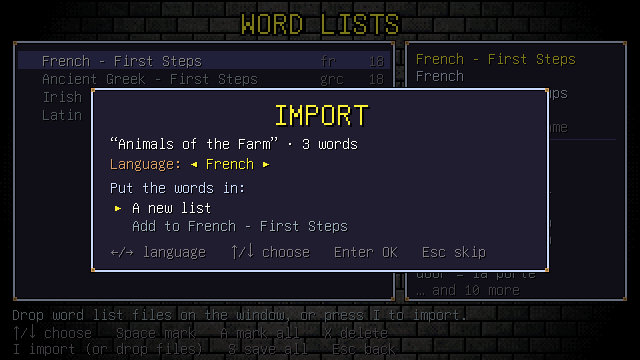
</p>

- **Import:** drag one or more files onto the game window (or the web page),
  or press <kbd>I</kbd> and type the file's path. Then choose to make it
  **a new list** or **add** its words to an existing list in the same
  language. Words that are already in the list are skipped. If the file has no
  `language:` line, pick the language with <kbd>←</kbd> / <kbd>→</kbd>.
- **Delete:** mark lists with <kbd>Space</kbd> (<kbd>A</kbd> marks them all),
  then press <kbd>X</kbd> or <kbd>Delete</kbd>. With nothing marked, it
  deletes the selected list. Starter lists can't be deleted, but deleting one
  you've added words to puts it back as it was.
- **Save:** changes are kept until you press <kbd>S</kbd>, which saves all
  lists at once. Leaving with unsaved changes asks first.
- **Word Forge:** with the [AI helper](#ai-helper-optional) on, press
  <kbd>F</kbd>, type a topic, and an AI makes and checks a new list for you
  to import.

Imported files can use the format below, or be a plain two-column
`english<Tab>answer` file, as spreadsheets and flashcard sites export them.

You can also put `.txt` files in the game's `words` folder yourself (in a web
browser, lists are kept in the page's local storage instead):

| OS | Folder |
|---|---|
| macOS | `~/Library/Application Support/halpwords/words/` |
| Windows | `%AppData%\halpwords\words\` |
| Linux | `~/.config/halpwords/words/` |

```text
# Lines starting with # are comments.
title: French - Animals
language: fr

## animals
dog = le chien
friend = l'ami | l'amie

## sentences
>> Mon ___ aboie. | chien
```

- Put one word per line: `english = answer`. Put any other accepted answers
  after `|`.
- The language codes are `fr` (French), `la` (Latin), `grc` (Ancient Greek)
  and `ga` (Irish).
- `## name` starts a group of related words. Groups are used for odd-one-out
  puzzles, so give each group at least three words.
- `>>` lines are gap-fill sentences: a sentence in the language you're
  learning with `___` for the gap, then `|` and the word that goes in it,
  which must be one of the list's answers. Doors and chests then ask you to
  fill the gap (not in Hardcore or the Daily Dungeon, which use the same
  puzzles for everyone).
- Optional header lines: `level:` (such as `A1`), `source:` (where the
  words come from, such as a textbook unit) and `licence:` (such as
  `CC-BY-4.0`). `id:` and `version:` are set by the Halpwords website. Lines
  whose name starts with `x-` are ignored, and any other `name:` line is an
  error, as it's usually a typo.
- Riddle puzzles use the English riddles in
  [`assets/puzzles/riddles.txt`](assets/puzzles/riddles.txt), so they work
  for any language. Words without a riddle there just get other puzzles.
- A file with the same name as a starter list (such as `french.txt`)
  replaces that starter list.

The built-in lists are in [`assets/words/`](assets/words).

## Quests and hand-made maps

Every floor of an Adventure is made by the game. A **quest** is made by
hand instead: 1 to 10 floors in order, with an introduction and an ending,
such as a teacher's escape room around this week's words. The game comes
with one, *The Scribe's Cellars*, under **New Adventure → Quest**. To add
another, drop a `.hwquest` file (a quest) or a `.hwmap` file (one floor)
on the window. The game checks it and keeps it in the `quests` folder (see
[Where your files are](#where-your-files-are)).

On a quest floor, monsters, puzzles and loot work as on any other floor.
Taking the stairs on the last floor ends the quest. Quests have Save
Shrines only where their maker put them.

**Play-testing.** The map editor on a Halpwords server can open the web
game with a quest to try out: the page's address ends in
`?quest=<address of the .hwquest file>`. The game fetches the file only
from its own website (the same address up to the path; anything else is
refused), checks it, and starts it. Nothing is saved during a play-test,
and your own saves in that browser are left alone.

Both files are JSON. A map is a grid of up to 40×40 cells, one character
each, with the monsters, the puzzles on sealed doors and chests, and notes
on walls listed by cell:

```json
{
  "format": "hwmap", "version": 1,
  "title": "Escape Room", "language": "fr",
  "theme": "Ice Halls", "depth": 2,
  "rows": [
    "#######",
    "#@..C.#",
    "#.###=#",
    "#.#M..#",
    "#.+..>#",
    "###T###"
  ],
  "monsters": [{"x": 4, "y": 4, "kind": "Cave Bat", "trait": "swift"}],
  "locks": [{"x": 5, "y": 2, "puzzle": "anagram", "word": "le chat"},
            {"x": 4, "y": 1, "puzzle": "tumbler", "mimic": true}],
  "notes": [{"x": 3, "y": 5, "text": "Two ways down."}]
}
```

| Cell | Is | Cell | Is |
|---|---|---|---|
| `#` | wall | `T` | wall with a torch |
| `.` | floor | `@` | the start |
| `+` | door | `=` | sealed door |
| `C` | chest | `>` | stairs down |
| `S` | Save Shrine | `F` | campfire |
| `M` | merchant | | |

- `language` is the language's code; leave it out and the player chooses.
  `depth` is the generated floor the map plays like (how strong monsters
  are, which puzzles, what chests hold). `theme` is one of the floor looks,
  such as `The Crypt`. `facing` (`N`, `E`, `S` or `W`) is the way the hero
  faces at the start.
- A monster's `kind` is a monster's or boss's name, such as `Grumpy Rat` or
  `Slime King`; `level` scales it (it defaults to the map's depth) and
  `trait` gives it an extra power: `armored`, `ghostly`, `mirrored` or
  `swift`. A boss holds the stairs shut until it's beaten.
- A lock's `puzzle` is one of `reverse`, `anagram`, `odd-one-out`, `pairs`,
  `riddle`, `spell` or `gap-fill` for sealed doors, and `missing`,
  `anagram`, `tumbler`, `spell`, `crossword` or `gap-fill` for chests.
  `word` picks the word it asks for (an answer or its English); a word
  your lists don't have gets another word instead.
- The map must have a wall all around, one start and one stairs, doors
  between two walls, and a way from the start to the stairs and everything
  else. The start must have a way out that isn't a sealed door.

A quest holds its maps:

```json
{
  "format": "hwquest", "version": 1,
  "title": "Week 5", "language": "fr",
  "intro": "Find the way out of the vault!",
  "ending": "You made it. Well done!",
  "maps": [{"format": "hwmap", "version": 1, "title": "The Vault", "rows": ["..."]}]
}
```

The rules and checks are in [`pkg/maps`](pkg/maps), which the Halpwords
website's map editor uses too.

## Where your files are

Saves, settings, progress, the Hall of Fame, your own word lists and the
quests you've added are in your user folder:

| System | Folder |
|---|---|
| macOS | `~/Library/Application Support/halpwords` |
| Windows | `%AppData%\halpwords` |
| Linux | `~/.config/halpwords` |
| Web browser | The browser's local storage for the page |

If the game ever crashes, it writes what went wrong to `crash.txt` in that
folder. Please attach it to a [bug report](https://github.com/halpworld/halpwords/issues).

## Building

```sh
make run             # run the game
make check           # go vet, gofmt check and unit tests
make sounds          # write the sound effects and music to dist/sounds as WAV files
make balance         # play the dungeon with typing bots and print the balance
make icon            # draw the app icon into dist/icon
make build           # build for this computer
make build-mac       # Apple Silicon (from any OS)
make build-mac-intel # Intel Macs (from any OS)
make bundle-mac      # dist/Halpwords.app for every Mac, with its icon (needs macOS)
make build-windows   # Windows .exe with its icon (from any OS)
make build-linux     # Linux (run on Linux; needs the packages above)
make build-web       # WebAssembly, in dist/web
make serve-web       # build the web version and play it at http://localhost:8000
make release-web     # zip a build for release into dist/release (also -mac, -windows, -linux)
make help            # list all targets
```

Builds are stamped with the version from the latest git tag. Pushing a tag
such as `v1.0.1` builds every platform, publishes a GitHub release and
updates the web version. See [docs/RELEASING.md](docs/RELEASING.md).

<details>
<summary><b>Project layout</b></summary>

```text
cmd/halpwords/     entry point
internal/game/     main loop, scene stack, pixel-perfect scaling
internal/scene/    screens (title, practice, the dungeon crawl, ...)
internal/dungeon/  floor generation, monsters, bosses, shrines and shops
internal/rpg/      classes, stats, levels, items and gear (no Ebitengine dependency)
internal/profile/  settings, word progress and the Hall of Fame, kept between runs
internal/save/     save files (local storage on the web)
internal/raycast/  first-person 3D view
internal/typing/   text entry, Tab accents, Greek input mode
internal/combat/   battle formulas and monster trait effects
internal/llm/      optional AI: providers, keys, budget, Director, generated content (no Ebitengine dependency)
internal/clipboard/ pasting from the system clipboard
internal/audio/    sound effect synth and music composer (no Ebitengine dependency)
internal/sim/      typing bots that play the dungeon, to check the balance (no Ebitengine dependency)
internal/input/    keyboard helpers
internal/gfx/      drawing: text, windows, torches, sparks
internal/pal/      the 32-colour palette
internal/unifont/  bitmap font parser
pkg/               public API shared with halpwords-server (no Ebitengine dependency):
pkg/words/         word lists, languages, grading, spaced repetition, mistake kinds
pkg/compete/       Hardcore score, seed and share codes, Daily Dungeon, Hall of Fame
pkg/puzzle/        door and chest word puzzles
pkg/proc/          procedural pixel art and the app icon
pkg/safety/        family-safe policy and filter for generated text
assets/            embedded font, starter word lists and riddle bank
tools/fontsubset/  regenerates the font subset from GNU Unifont
tools/sfxdump/     writes the sound effects and music as WAV files
tools/balance/     prints the balance tables from the typing bots
tools/icon/        writes the app icon as PNG, .icns and .ico
build/             the macOS app's Info.plist and the web page
docs/media/        README screenshots and GIFs
```

</details>

## Roadmap

The full design is in [PLAN.md](PLAN.md). In short:

- [x] **M0: Skeleton.** Window, scaling, font, Unicode input, grading, Tab
      accents, Greek input, Spelling Practice.
- [x] **M1: Dungeon crawl.** Raycast view, generator, automap, torches,
      stairs and floor save points, typing battles, sealed doors, chests.
- [x] **M2: Words and combat.** Mostly done early in M0 and M1, plus sound
      effects and monster traits (Armored, Ghostly, Mirrored, Swift).
- [x] **M3: Puzzles.** Nine puzzle types (reverse rune, odd one out, pair
      matching, riddle, anagram, missing letters, tumbler lock, mini
      crossword, spelling), a riddle bank, and the Mimic.
- [x] **M4: RPG layer.** Three classes, six stats, items, generated gear,
      a merchant, campfires, bosses, Save Shrines, suspend saves, hints.
- [x] **M5: Learning and competition.** Spaced repetition, the Grimoire,
      settings for each language, Hardcore mode with a score, the Daily
      Dungeon, seed and share codes, and the Hall of Fame.
- [x] **M6: AI helper (optional).** Anthropic, OpenAI, Meta and DeepSeek;
      a setup screen with key checks, model choice, a budget and spending;
      the Dungeon Director, gap-fill puzzles and riddles, monster taunts,
      the Scroll of Insight and the Word Forge.
- [x] **M7: Polish and ship.** Procedural music, a CRT filter, sparks and
      hit-stop, sound and screen settings, a balance simulation and the
      tuning it led to, an app icon, crash reports, and release builds for
      macOS, Windows, Linux and the web.

## Contributing

Contributions are welcome, from bug reports to new word lists to code.

- **Found a bug or have an idea?** [Open an issue](https://github.com/halpworld/halpwords/issues).
  For dungeon bugs, include the `HALPWORDS_SEED` if you can.
- **Sending a pull request?** Run `make check` first. CI runs the same
  checks and builds every platform. If you change monsters, heroes or the
  battle formulas, run `make balance` and compare the tables.
- **Know one of the languages?** Corrections to the
  [starter word lists](assets/words) are very welcome, and so are new
  [riddles](assets/puzzles/riddles.txt).

## License

- Code: [Apache License 2.0](LICENSE).
- Font: [GNU Unifont](https://unifoundry.com/unifont/), used under the SIL
  Open Font License 1.1 (see
  [assets/fonts/OFL-1.1.txt](assets/fonts/OFL-1.1.txt)).

## Acknowledgements

- [Ebitengine](https://ebitengine.org), the 2D game engine for Go.
- The Commodore 64 and Amiga crawlers that inspired it: *The Bard's Tale*,
  *Dungeon Master* and *Eye of the Beholder*.
