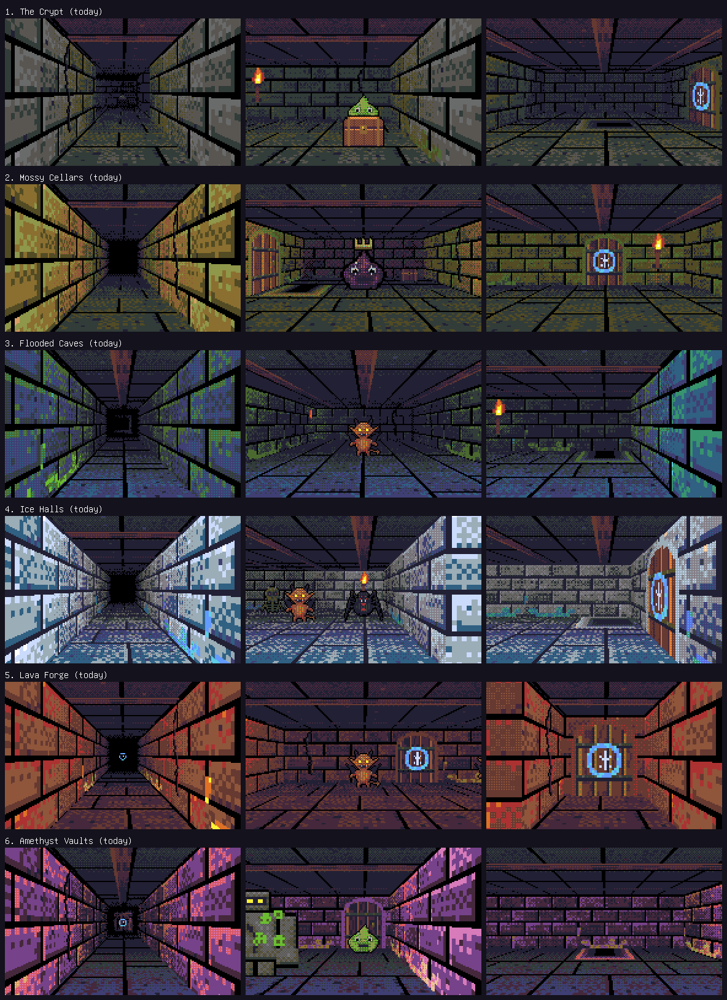
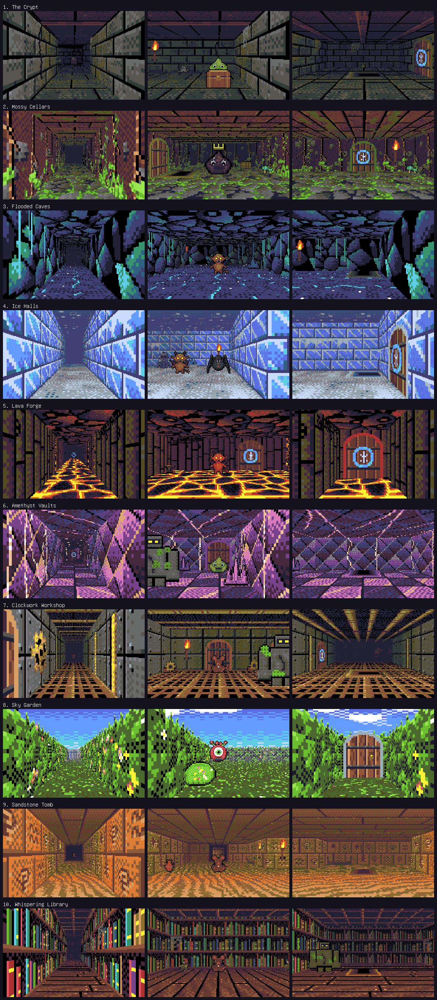

# Worlds: every floor looks different

Tracking issue: halpworld/halpwords#72. Status: design approved by the
owner's choices of 2026-10-01; being built.

A player asked for every floor to look different. Reaching a new floor
should feel like arriving somewhere new, not the same dungeon in other
colours.

## Why it looked the same

Every `proc.Theme` fed the same generators (`BrickWall`, flagstone floor,
beam ceiling) and only swapped colour ramps. The renderer's shade table
always faded to black with the same warm torch tint. So every floor had the
same shapes, the same dark distance and the same ceiling.

## Chosen approach

**Procedural worlds built from families, modifiers and light, all on the
CPU and inside the 32-colour palette.** No hand-made art and no new shader.

A world is a recipe:

- **Surface families**, one function each that paints a tiling 32×32
  `proc.Indexed`:
  - walls: Bricks, Cave, Ice, Basalt, Metal, Crystal, Earth, Sandstone,
    Books, Hedge;
  - floors: Flagstones, Cobbles, Sand, Water, Snow, Lava, Grass, Planks,
    Checker, Grate;
  - ceilings: Beams, Rock, Ice, Pipes, Crystal, Slabs, Coffers, or an open
    sky.
- **Modifiers** layered on a surface: Moss, Crack, Cobweb, Frost, Drips,
  Veins, Gear, Pipe, Flowers, RaggedTop, Vines, Soot, GlowCracks, SandDrift.
  The three wall variants per world are the base plus modifiers.
- **Palette ramps**: the theme's existing `Wall`, `Floor`, `Ceil` and `Moss`
  ramps, plus an accent ramp.
- **Light**: a fog colour that distance fades towards (instead of black), a
  light tint, a light reach, and a ceiling height. These go into the
  renderer's shade table, which is built once per floor. They cost nothing
  per frame.
- **Dressing**: one decor prop per world (bones, glowing mushrooms,
  stalagmites, ice shards, an anvil, crystals, a cog, a flower bush, an urn,
  a book pile with a candle), placed on a few empty floor cells. One
  particle kind per world (dust, fireflies, drips, snow, embers, sparkles,
  steam, petals, sand, floating letters). One ambience layer per world, mixed
  into the floor's music.

Ten families of each kind, combined with modifiers, ramps and light, give
many more worlds than we ship. A new world is a table entry, not new code.

Doors, sealed doors, torches, stairs and chests keep **the same shape in
every world**. Only the frame material changes, so a child never has to
relearn what an exit looks like.

## Rejected options

- **Palette swaps only (today):** this is the problem.
- **Hand-drawn tile sets per world:** against the procedural-first rule, and
  it doesn't scale.
- **A per-world Kage shader (tint, wobble, heat shimmer):** the shade table
  already does fog and tint in the palette at no cost. Wobble hurts
  readability and photosensitivity. It would also be a second render path
  to test on WebGL.
- **A higher render resolution:** 640×360 would take about 84% of a wasm
  frame.
- **A seeded shuffle of the world order per run:** a fixed order lets a
  child say "I reached the Ice Halls!", keeps Daily runs the same for
  everyone, and lets us design neighbouring floors to contrast. The AI
  Director still varies the look.
- **Renaming "The Crypt" and dropping "Amethyst Vaults"** (the art review
  suggested both): both names are part of the map and Director contract, so
  they are redesigned instead.
- **Letting teacher maps pick the new worlds now:** an old game rejects a
  whole quest with an unknown theme. That needs the server to strip new
  themes for old games, so it is a follow-up.

## Worlds in the first release

`proc.Themes` is **append-only**. The first six keep their names and
indices; four are appended. The floor order is a separate table, chosen so
neighbouring floors differ in hue and brightness, and so the bright Sky
Garden never follows the Ice Halls.

| Floor | Index | World | Walls / floor / ceiling | Fog, light | Prop, particles, ambience |
|---|---|---|---|---|---|
| 1 | 0 | The Crypt | bricks, cobwebs, cracks / flagstones / beams | black, warm torch (today's look) | bones, dust, low wind |
| 2 | 1 | Mossy Cellars | earth with roots and vines / mossy cobbles / mossy brick | dark olive | glowing mushrooms, fireflies, crickets |
| 3 | 2 | Flooded Caves | cave rock with drips / rippling water / rock with stalactites | deep blue, longer reach | stalagmite, drips, water drops |
| 4 | 4 | Lava Forge | basalt with glowing cracks / lava cracks / red rock | dark red | anvil, embers, rumble and crackle |
| 5 | 3 | Ice Halls | ice blocks with frost / snow / icicles, tall | indigo, cold light | ice shards, snow, wind |
| 6 | 9 | Whispering Library | bookshelves / planks / wooden coffers, tall | dark plum, candle light | book pile with candle, floating letters, page rustle |
| 7 | 7 | Sky Garden | hedges with flowers / grass / open sky | sky blue, long reach | flower bush, petals, birdsong |
| 8 | 6 | Clockwork Workshop | steel with brass gears and pipes / brass grate / pipes | brown | cog, steam puffs, ticking |
| 9 | 5 | Amethyst Vaults | crystal facets with glowing veins / checker / crystal | plum | crystal cluster, sparkles, chimes |
| 10 | 8 | Sandstone Tomb | glyph blocks (glowing turquoise glyphs) / rippled sand / slabs | cool dusk, not orange | urn, drifting sand, soft wind |

From floor 11 the order repeats as a **second lap**. Each world returns with
its other wall variants as the base, a denser prop layer and a slightly
shifted fog, so floor 11 never looks exactly like floor 1. `proc.Lap(depth)`
gives the lap.

**More worlds later** cost a table row: pick families, modifiers, ramps,
light, a prop and particles. Ideas: Candy Caverns, Sunken Temple, Mushroom
Forest, Star Observatory. Each new world needs an append to `proc.Themes`
and a place in the floor order.

## Where the changes go

- `pkg/proc`:
  - `families.go`: surface painters and modifiers.
  - `worlds.go`: world fields on `Theme`, the floor order, `ThemeFor`,
    `Lap`, props.
  - `ThemeFor(depth)` moves from "a theme every two floors" to the floor
    order table. `ThemeFor(1)` stays The Crypt.
  - The Crypt's wall, door, torch and stairs textures stay
    **byte-identical**: the server draws `DoorTexture(ThemeFor(1), 7, true)`
    on its web pages.
  - The old exported generators keep their signatures.
- `pkg/maps`: `maps.Themes` stays the original six. `TestThemesMatchTheGame`
  becomes "maps.Themes is a prefix of proc.Themes".
- `internal/raycast`:
  - `SetWorld`: a per-world shade table with fog colour, tint and reach.
  - Ceiling height, sky panorama, see-through wall pixels (hedge tops), and
    4-frame animated floors (water, lava).
  - Decor sprites and a minimum light for sprites, so monsters never sink
    into fog.
  - Particles drawn into the 192×120 view buffer, never over the HUD.
- `internal/scene`:
  - Arrival card: "Floor N", the world or Director name, and a tagline.
    Skippable, and play is never blocked.
  - The world's decor, particles and ambience wired in.
  - A **Calm effects** option in Sound & Screen: no particles, static water
    and lava, steady torches.
  - Boss Raid pins its look to Mossy Cellars, as today.
- `internal/audio`: `Track` gains an `Ambience`. The delve loop mixes a
  procedural ambience layer (noise and tone recipes) under the music. No new
  player is needed.
- Shaders: none.

## Performance budget

The 3D view is 192×120 art pixels, scaled ×2. Baseline (Apple M4): 0.31 ms
per frame on desktop and 1.4 ms on wasm (node), with 0 allocations.

- Whole `Render` per world: **at most 0.6 ms on desktop and 3.0 ms on
  wasm**.
- 0 allocations per frame without sprites.
- Texture generation: under 100 ms per floor (the spike takes about
  1.6 ms).
- Props stay small (size 0.4 or less), with at most 20 per view.
- The spike measured Crypt 306 µs, Ice 318, Library 328 and Sky 186 (the sky
  is cheaper than a textured ceiling).
- Don't add per-pixel `sqrt`, `atan2` or closures to the floor/ceiling loop.
  It is 88% of the frame.

## Determinism rules

1. Visual generation never calls `run.rng`, never creates a generator from
   it, and never calls into `dungeon.Generate`.
2. Props, particles and lap remixes use their own PCG, seeded from
   `l.Seed`, depth and a fixed salt.
3. Nothing visual is written into `dungeon.Level` (`Features`, `Torches`,
   `Chests` and `Monsters` feed saved state).
4. Saves store no theme. A resumed run re-derives its look, and only its
   look changes. Director scripts store a theme index, which append-only
   keeps valid.

## Contract impact

- **AI Director:** the game sends all ten names. A server not yet bumped
  drops the names it doesn't know, so its Director picks only from the old
  six. After the server's `go.mod` bump it picks from all ten. `MaxThemes`
  (24) has room.
- **Teacher maps:** unchanged in this release (the original six only).
  Follow-up: the server strips new themes from maps served to old games,
  using the game version it already sees, before the editor offers them.
- **Server art:** `DoorTexture(ThemeFor(1))` is unchanged byte for byte.
- **Server:** bump `go.mod` after the game merge and run its `make check`.
  No other server code change is needed.
- **Old games and old servers:** need nothing.

## New strings

All are English game strings; the game has no translation catalogue.

- World names: Clockwork Workshop, Sky Garden, Sandstone Tomb, Whispering
  Library.
- Ten taglines, at most eight words each, reading age 9+, nothing scary.
- The option label "Calm effects" and its hint.

There are no Irish strings: the server catalogue has no theme names, and
theme names stay English on both sides. If a later server change shows
world names in Irish, those go through halpwords-language-reviewer, marked
as drafts under Q81.

## Readability and accessibility rules (tested)

- Monster body against fog and mid-distance wall/floor: luminance contrast
  of at least 1.5:1 for every world × monster ramp. Sprites get a minimum
  light of 0.35.
- Stairs, sealed doors, doors and chests: the same silhouette everywhere,
  and at least 3:1 against the wall beside them.
- World effects draw only inside the 3D view; the HUD and typing panel are
  pixel-identical across worlds.
- No more than one pulse per second, under 15% brightness change, and no
  full-view flash. At most about 12 sparkles at once. Snow and petals fall
  slower than 20 px/s. Water and lava animate at 2 frames a second or less.
  No camera wobble.
- Sky Garden: no fog or sky colour above about 85% luminance.
- The balance analyst checks that no world shortens how far a monster can
  be seen compared with today.

## Test strategy

- **Determinism golden (first commit, before any change):** sha256 of
  `dungeon.Generate` output for these cases, recorded on `origin/main` as
  constants:
  - depths 1–12 for fixed seeds;
  - Daily seeds for fixed dates;
  - a Seed Challenge code;
  - Hardcore (`Harden`);
  - `FromMap`.

  The hash covers tiles, rooms, start, exit, torches, chests, features and
  monsters. A scene test also checks that `run.src` is byte-identical before
  and after a crawl and its decor are built.
- **Per-world texture hashes:** for each world, a hash of every generated
  texture at a fixed seed. Changing art means updating a hash on purpose.
  The Crypt's hashes must equal today's.
- **Per-world render goldens:** a hash of a 192×120 frame from a fixed
  camera for each world, plus `tools/worldsheet` to regenerate the contact
  sheet for review.
- **Readability tests:** the contrast rules above, as unit tests.
- **Frame time:**
  - `testing.AllocsPerRun` on `Render`: 0 for every world.
  - A relative test: each world's median render time is at most 2× The
    Crypt's in the same process.
  - A generous absolute ceiling, skipped under `-short` and the race
    detector.
  - `BenchmarkRender` per world for humans.
  - A wasm run of the benchmark (`GOOS=js GOARCH=wasm` with node) recorded
    in the changelog notes.
- **Contract:** `maps.Themes` is a prefix of `proc.Themes`; the old six
  names and indices are pinned; `DoorTexture(ThemeFor(1), 7, true)` hash
  pinned.

## Task breakdown

These clusters can run in parallel; merge order is 1, then 2 and 3 in any
order, then 4.

1. **World core (`pkg/proc`, `internal/raycast`, `pkg/maps` test):**
   - the determinism golden first;
   - families, modifiers, world table, floor order, `Lap`;
   - shade table, ceiling height, sky, animated floors, decor, particles,
     sprite light floor;
   - per-world hashes, readability tests, frame-time tests;
   - `tools/worldsheet`.
2. **Arrival and options (`internal/scene`, `internal/profile`):**
   - the arrival card with taglines (skippable, never blocks);
   - the Calm effects option;
   - Raid pinned to Mossy Cellars.
   - After 1 merges: wire decor, particles and Calm into the crawl.
3. **Ambience (`internal/audio`, `internal/scene/music.go`):**
   - `Track.Ambience`, procedural ambience recipes mixed into the delve
     loop, one per world;
   - a test that loops have no seam and stay under the music volume.
4. **Server bump:** the server's `go.mod` moves to the merged game, then
   its `make check` runs (lead).
5. **Docs:** CHANGELOG, PLAN §9, this document, follow-up issues.
